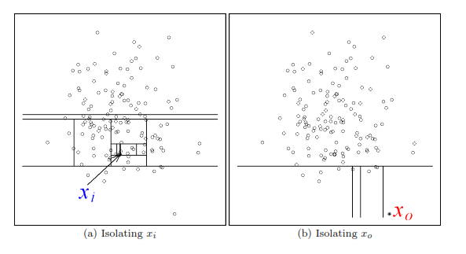

<style>
body{
text-align: justify}
</style>


# Backround


An anomaly is a data point or collection of points in data that diverse from the pattern containing in the data. Some instances of this case are a single 10 C daily temperature in Jakarta of ordinary summer day. The temperature is extremely low comparing to the daily temperature of Jakarta which is around 28 C. Another example of an anomaly is 10 consecuitive days of rain in Sahara Desert, one of the driest place on Earth. 


```{r, echo=FALSE, out.width="50%", fig.cap="Sahara Desert."}
knitr::include_graphics("Sahara.jpg")
```


An anomaly is not limited to a weather case. We can also find an anomalous conditions in the banking industry. A fraud in financial transactions is also an anomalous condition that diverse from the pattern, which are those transactions that is genuine.

A bank can't let fraud happens every time, affecting the financial loss of the company. A set of fraud transactions will be huge if the company doesn't track the situation. One mechanism to minimize this kind of financial loss is detecting the transactions that are considered fraud.

Some techniques to find fraud conditions using machine learning are logistic regression, random forest or supervised machine learning for classification. Since a set of assumptions influences a supervised machine learning algorithm, a researcher must pay attention when this condition is violated. Another consideration is looking at the data that involves enormous transactions in terms of size.


```{r, echo=FALSE, out.width="50%"}

```

Another method for anomaly detection is using an unsupervised machine learning algorithm. Local Outlier Factor (LOF), One-Class Support Vector Machine, and Isolation Forest can be used as an alternative to the supervised machine learning procedure. One of them, namely isolation forest, is capable of dealing with large data sets. Isolation Forest is also used adequate memory usage; hence it is a good fit for productivity.


# What is Isolation Forest Alghoritm?


To better visualize this algorithm, think there are a group of zebras that travel in herds. Because of size, a single zebra will be easier to be targeted by predators. Hence, they travel with their groups to avoid the risk of being targeted. The zebra that travels alone will be more vulnerable to predators. Due to their large size, the predators will be easier to target and isolate a single zebra as their prey than groups of zebra who travel in herds.


```{r, echo=FALSE, out.width="50%"}

```


The algorithm of Isolation Forest works the same by targeting the observation that stands alone after the isolation is applied to the observation. The observation far from the rest will be identified as unusual rather than gathered in groups that share the similarity. The more points travel from the groups, the more indication we can consider that as an anomaly.	
The isolation forest will choose attributes originating from the data in random and recursively partition the observation of the maximum and minimum value of the selected features. The observation that requires less partition will likely be an anomaly than the observation that requires more separation.

```{r, echo=FALSE, out.width="50%"}

```

From the picture above, point (b) is considered more anomalous than point (a) as it requires more partition.

# Dataset Introduction

We will use this algorithm to gain insight of fraud case of financial transaction. The data source can be found [here](https://www.kaggle.com/ealaxi/paysim1)

This dataset is a synthetic dataset generated using the simulator called PaySim. The dataset contain financial transaction with fraud observations. First, we need to load the data and call the needed library for this early step.

```{r message=FALSE, warning=FALSE}

library(readr)
library(tidyverse)
library(ggplot2)
library(plotly)
library(GGally)
library(highcharter)
library(caret)

fraud <- read.csv("DATA/fraud.csv")

str(fraud)

```

Each fitures of the data is described as follows:

* `step`  - maps a unit of time in the real world. In this case 1 step is 1 hour of time. Total steps 744 (30 days simulation).
* `type` - CASH-IN, CASH-OUT, DEBIT, PAYMENT and TRANSFER.
* `amount` - amount of the transaction in local currency.
* `nameOrig` - customer who started the transaction
* `oldbalanceOrg` - initial balance before the transaction
* `newbalanceOrig` - new balance recipient after the transaction.
* `nameDest` - customer who is the recipient of the transaction
* `oldbalanceDest` - initial balance recipient before the transaction.
* `newbalanceDest` - new balance recipient after the transaction.
* `isFraud` - This is the transactions made by the fraudulent agents inside the simulation. 
* `isFlaggedFraud` - The business model aims to control massive transfers from one account to another and flags illegal attempts. 

# Dataset Cleaning

Before we implement the algorithm, we will see the dimension of this data first 

```{r}
dim(fraud)
```

The data consist of more than 6 million observations and 11 variables. Since the data is large, cleaning the dataset beforehand is a prerequisite for efficiency as the computer will have to deal with a large amount of data.

The first thing we need to eradicate the variables that do not contribute to the investigation. The variable of `nameOrig` and `nameDest` consist of a vast amount of unique values. We create a new object to differentiate from the uncleaned dataset and drop these two variables as our first step.


```{r}
fraud_clean <- fraud %>% 
  select(-c(nameOrig, nameDest)) 
```


The second step is we convert the variable that is not suitable for the analysis. The variables of `type` are under character type. This variable is important for the identification of the type of transaction. We will convert this one into a factor type.


```{r}
fraud_clean <- fraud_clean %>% 
  mutate(type = as.factor(type),
         isFraud = as.factor(isFraud))
```

Now, we see the data once again

```{r}
str(fraud_clean)
```

The data now provides suitable type for each variables. We can continue to explore the information containing in the data.


# Data Exploration

The difference number of fraud against genuine transactions is quite large. It can be seen as follow.

```{r}
library(treemap)


transaction <- c("fraud","genuine")
value <- c(sum(fraud_clean$isFraud == 1), sum(fraud_clean$isFraud == 0))
percentage <- c(sum(fraud_clean$isFraud == 1)/length(fraud_clean$isFraud)*100,
                sum(fraud_clean$isFraud == 0)/length(fraud_clean$isFraud)*100)
information <- data.frame(transaction,value,percentage)

information
```

The fraud transaction is tiny compared to the genuine transaction. It only contains less than 1% of the overall data.

We try to visualize the whole transactions based on the transaction type

```{r}
total_trans <- fraud_clean %>% 
  group_by(type) %>% 
  count(type) %>% 
  arrange(desc(n))
```

```{r echo=FALSE, include=FALSE}
trm <- treemap(total_trans,index="type",vSize="n",palette = "YlGnBu", title = "Transaction based on Type of Transactions")
```

```{r}

hctreemap(trm, allowDrillToNode = TRUE) %>% 
   hc_title(text = "Number of Transactions Based on Transaction Type") %>%
  hc_exporting(enabled = TRUE) 

```

The majority of the transactions came from Cash out with over than 2 millions transactions. The following transactions are Payment, Cash in and Debit.

We can also visualize the distribution of fraud transactions based in each type.

```{r}

total_fraud <- fraud_clean %>% 
  filter(isFraud == 1) %>% 
  select(type) %>% 
  group_by(type) %>% 
  count(type) %>% 
  arrange(desc(n))

```

```{r echo=FALSE, include=FALSE}
trmf <- treemap(total_fraud,index="type",vSize="n",palette = "Spectral", title = "Fraud Transactions based on Type of Transactions")
```

```{r}
hctreemap(trmf, allowDrillToNode = TRUE) %>% 
   hc_title(text = "Fraud Transactions Based on Transaction Type") %>%
  hc_exporting(enabled = TRUE) 
```

Here, we see that the fraud transactions only come from these two type of variables. The fraud transactions come from Cash_out and transfer variable.

We will shrink the data on focus only on the fraud condition with these two type of transactions.

```{r}
fraud_clean_real <- fraud_clean %>% 
  filter(type == "CASH_OUT" | type == "TRANSFER")

dim(fraud_clean_real)
```

```{r}
prop.table(table(fraud_clean_real$isFraud))*100
```

The number of fraud transactions is 0.3% after the second cleaning. This is much lower compared to the genuine transactions by 99.7%


# Anomaly Detection with Isolation Forest

First, we need to train the data into a train and test dataset to begin anomaly detection. The first attempt is splitting the data into 60% as the training dataset and 40% as the testing dataset.


```{r}
RNGkind(sample.kind = "Rounding")

set.seed(11)

library(rsample)

fraud_split <- initial_split(data = fraud_clean_real, prop = 0.6, strata = isFraud)

fraud_train <- training(fraud_split)
fraud_test <- testing(fraud_split)
```

```{r}
prop.table(table(fraud_train$isFraud))*100

table(fraud_train$isFraud)

```

```{r}
prop.table(table(fraud_test$isFraud))*100

table(fraud_test$isFraud)

```

The spliting above creates the relatively same proportion of the fraud vs genuine transactions. The Next step is we will do the Isolation Forest algorithm with a library named "isotree".

```{r}
library(isotree)

fraud_isotree <- isolation.forest(fraud_train %>% select(-isFraud), sample_size = 64)
```

The code above will build the algorithm with the default parameter. The default parameters are:

`sample_size` : The number of sample-size of data sub-samples with which each binary tree will be built. The default for this parameter is the length of the dataset. For memory management, we will try to use 64 sample sizes as the first attempt.

`ntrees` : Number of binary trees to build for the model. The default for these parameters is 10.

The Isolation Forest Aghoritm will produce an anomaly score with the range begin with 0 until 1. The interpretation of an anomaly score can be determined here:

1. If the anomaly score is closed to 1, it can be interpreted that that point is an anomaly.
2. If the anomaly score is minimal compared to 0.5, it can be interpreted as a regular data point.
3. If the anomaly score produced, all of them, is 0.5, then it can be confirmed that there is no anomaly for the sampling dataset.

```{r}
fraud_score <- predict(fraud_isotree, newdata = fraud_train %>% select(-isFraud))
fraud_train$score <- fraud_score
```

To analyze the performance of the alghoritm, we will use confusion matrix. The confusion matrix will be focusing on precision over the recall since we will try to minimize the normal customer wrongly categorized as customer with fradulent transaction. The insurance may loss the valuable customer for their business target.

Before continuing into confusion matrix, we will divide the anomaly score with the a spesific threshold. If the anomaly score is more than 80% quantile for the rest of data, we will clasify the point as an anomaly. This threshold can be tolerated with respective subject business matter.


```{r}
quantile(fraud_train$score, probs = c(0, 0.8))
```

```{r}
fraud_train <- fraud_train %>% 
  mutate(fraud_detection = as.factor(ifelse(fraud_score >= 0.4821847 , 1, 0)))
```


```{r}
fraud_conf <- confusionMatrix(fraud_train$isFraud, fraud_train$fraud_detection, positive = "1")

fraud_conf
```

An ROC curve (receiver operating characteristic curve) is a graph showing the performance of a classification model at different classification thresholds. We will also use this metric as the evaluation of the model performance.

```{r message=FALSE, warning=FALSE}
library(ROCR)

fraud_roc <- prediction(fraud_train$score, fraud_train$isFraud) 


plot(performance(fraud_roc, "tpr", "fpr"),
     main = "ROC")
abline(a = 0, b = 1)

```


```{r}
auc_ROCR_train <- performance(fraud_roc, measure = "auc")
auc_ROCR_train <- auc_ROCR_train@y.values[[1]]
auc_ROCR_train
```


The AUC produced is 0.87. The AUC score is good since the more AUC close to 1, the prediction performance will be better. 


# Visualizing The Isolation Forest Score

A contour plot can visualize the score produced by the Isolation Forest algorithm. The visualization will give us more insight into the polarization of the anomaly score. Since the visualization is limited to fewer dimensions, we will compress the data into two-dimension using PCA; then, we will take two dimensions produced by the PCA and visualize it in a contour plot provided by the `lattice` library.


```{r}
library(lattice)
library(FactoMineR)
library(factoextra)

fraud_pca_train <- PCA(fraud_train %>% select(step, amount, oldbalanceOrg, newbalanceOrig, oldbalanceDest, newbalanceDest, isFlaggedFraud), scale.unit = T, ncp = 7, graph = F)

fviz_eig(fraud_pca_train, ncp = 9, addlabels = T, main = "Variance explained by each dimensions")

```


By selecting the first two dimensions we will retain the information of the data by 56%. We store the data as a new object called `pca_grid`.

```{r}
pca_grid <- as.data.frame(fraud_pca_train$ind)
```


```{r}
pca_grid <- pca_grid %>%
  select(coord.Dim.1, coord.Dim.2)
```

Here, we will create a grid box for the spreading of the anomaly score.

```{r}
d1_seq <- seq(min(pca_grid$coord.Dim.1), max(pca_grid$coord.Dim.1), length.out = 100)
d2_seq <- seq(min(pca_grid$coord.Dim.2), max(pca_grid$coord.Dim.2), length.out = 100)

fraud_train_grid <- expand.grid(d1 = d1_seq, d2 = d2_seq)
head(fraud_train_grid)

```

By using these two dimensions, we create Isolation Forest object and visualize the anomaly score into a contour plot.

```{r}
library(isotree)

pca_isotree <- isolation.forest(fraud_train_grid, sample_size = 64)

fraud_train_grid$score <- predict(pca_isotree, fraud_train_grid)

```

```{r}
library(lattice)

contourplot(score ~ d1 + d2, fraud_train_grid, region = TRUE)

```

The purple color represents the points polarizing as the normal data transactions; here, we called genuine transactions. In contrast, the darker blue area is the region that far from the normal instances. The Isolation Forest will take the points that fall far from the normal point polarization as an anomaly. 


# Tuning The Isolation Forest Parameters

The Next attempt for this classification procedure is to improve the modelling performance by using several combination listing in the parameter. We will check the version of the model based on several numbers in `sample_size` and `ntrees`. The model with the highest AUC score is selected among the variation of the parameter tuning as the best model. We will the variation of ntrees with 10, 100 and the paramater for sample_size with 128,256 and 512.

## ntree = 10

```{r}

fraud_isotree_128 <- isolation.forest(fraud_train %>% select(step, type, amount, oldbalanceOrg, newbalanceOrig, oldbalanceDest, newbalanceDest, isFlaggedFraud), sample_size = 128)

fraud_isotree_256 <- isolation.forest(fraud_train %>% select(step, type, amount, oldbalanceOrg, newbalanceOrig, oldbalanceDest, newbalanceDest, isFlaggedFraud), sample_size = 256)

fraud_isotree_512 <- isolation.forest(fraud_train %>% select(step, type, amount, oldbalanceOrg, newbalanceOrig, oldbalanceDest, newbalanceDest, isFlaggedFraud), sample_size = 512)


```

Each of the Isolation Forest object is used to predict the train dataset with respective `sample_size`

```{r}
fraud_score_128 <- predict(fraud_isotree_128, newdata = fraud_train %>% select(-isFraud))

fraud_train$score_128 <- fraud_score_128

fraud_score_256 <- predict(fraud_isotree_256, newdata = fraud_train %>% select(-isFraud))

fraud_train$score_256 <- fraud_score_256

fraud_score_512 <- predict(fraud_isotree_512, newdata = fraud_train %>% select(-isFraud))

fraud_train$score_512 <- fraud_score_512

```

We calculate the AUC Score for each number of tree

```{r}
fraud_roc_128 <- prediction(fraud_train$score_128, fraud_train$isFraud) 

fraud_roc_256 <- prediction(fraud_train$score_256, fraud_train$isFraud) 

fraud_roc_512 <- prediction(fraud_train$score_512, fraud_train$isFraud)


auc_ROCR_train_128 <- performance(fraud_roc_128, measure = "auc")
auc_ROCR_train_128 <- auc_ROCR_train_128@y.values[[1]]

auc_ROCR_train_256 <- performance(fraud_roc_256, measure = "auc")
auc_ROCR_train_256 <- auc_ROCR_train_256@y.values[[1]]

auc_ROCR_train_512 <- performance(fraud_roc_512, measure = "auc")
auc_ROCR_train_512 <- auc_ROCR_train_512@y.values[[1]]
```

```{r}
number_of_tree <- c("128", "256", "512")
auc_tree_10 <- c(auc_ROCR_train_128, auc_ROCR_train_256, auc_ROCR_train_512)
tree_10 <- data.frame(number_of_tree,auc_tree_10)

tree_10
```


By the tuning of the `sample_size` parameter, we see the improvement of the AUC. The best model is with `ntrees` = 10 and `sample_size` = 256 with 0.881 AUC Score. 

## ntrees = 100

Let's try the model with 100 as the number of binary tresses to build for the model. 

```{r}

fraud_isotree_128_t100 <- isolation.forest(fraud_train %>% select(step, type, amount, oldbalanceOrg, newbalanceOrig, oldbalanceDest, newbalanceDest, isFlaggedFraud), sample_size = 128, ntrees = 100)

fraud_isotree_256_t100 <- isolation.forest(fraud_train %>% select(step, type, amount, oldbalanceOrg, newbalanceOrig, oldbalanceDest, newbalanceDest, isFlaggedFraud), sample_size = 256, ntrees = 100)

fraud_isotree_512_t100 <- isolation.forest(fraud_train %>% select(step, type, amount, oldbalanceOrg, newbalanceOrig, oldbalanceDest, newbalanceDest, isFlaggedFraud), sample_size = 512, ntrees = 100)

```

```{r}
fraud_score_128_t100 <- predict(fraud_isotree_128_t100, newdata = fraud_train %>% select(step, type, amount, oldbalanceOrg, newbalanceOrig, oldbalanceDest, newbalanceDest, isFlaggedFraud))

fraud_train$score_128_t100 <- fraud_score_128_t100

fraud_score_256_t100 <- predict(fraud_isotree_256_t100, newdata = fraud_train %>% select(step, type, amount, oldbalanceOrg, newbalanceOrig, oldbalanceDest, newbalanceDest, isFlaggedFraud))

fraud_train$score_256_t100 <- fraud_score_256_t100

fraud_score_512_t100 <- predict(fraud_isotree_512_t100, newdata = fraud_train %>% select(step, type, amount, oldbalanceOrg, newbalanceOrig, oldbalanceDest, newbalanceDest, isFlaggedFraud))

fraud_train$score_512_t100 <- fraud_score_512_t100
```


```{r}

fraud_roc_128_t100 <- prediction(fraud_train$score_128_t100, fraud_train$isFraud) 

fraud_roc_256_t100 <- prediction(fraud_train$score_256_t100, fraud_train$isFraud) 

fraud_roc_512_t100 <- prediction(fraud_train$score_512_t100, fraud_train$isFraud)


auc_ROCR_train_128_t100 <- performance(fraud_roc_128_t100, measure = "auc")
auc_ROCR_train_128_t100 <- auc_ROCR_train_128_t100@y.values[[1]]

auc_ROCR_train_256_t100 <- performance(fraud_roc_256_t100, measure = "auc")
auc_ROCR_train_256_t100 <- auc_ROCR_train_256_t100@y.values[[1]]

auc_ROCR_train_512_t100 <- performance(fraud_roc_512_t100, measure = "auc")
auc_ROCR_train_512_t100 <- auc_ROCR_train_512_t100@y.values[[1]]

```
```{r}
number_of_tree_ <- c("128", "256", "512")
auc_tree_100 <- c(auc_ROCR_train_128_t100, auc_ROCR_train_256_t100, auc_ROCR_train_512_t100)
tree_100 <- data.frame(number_of_tree_,auc_tree_100)

tree_100
```

The Next updated best model is the model with `ntrees` = 100 and `sample_size` = 256, as the model produced slightly better AUC than the previous one. If the anomaly score does not differ greatly, it shows the convergence of the models is reached. We will use parameters to build the model with the test dataset.

Before seeing the performance of the test dataset, we will see the updated version of the model in the training dataset based on the confusion matrix.

```{r}
quantile(fraud_train$score_512_t100, probs = c(0, 0.8))
```
```{r}
fraud_train_new <- fraud_train %>% 
  mutate(fraud_detection_new = as.factor(ifelse(score_512_t100 >= 0.4053975 , 1, 0)))
```


```{r}
fraud_conf_new <- confusionMatrix(fraud_train_new$isFraud, fraud_train_new$fraud_detection_new, positive = "1")

fraud_conf_new
```


The precision is 0.77 which is not too far compared with the model with `ntrees` = 10 and `sample_size` = 64.

The Next one is we apply the training model into the testing dataset. The procedure is the same with the training data.

Here, we predict the testing data with the Isolation Forest build with the training dataset.

```{r}

fraud_score_test <- predict(fraud_isotree_256_t100, newdata = fraud_test %>% select(step, type, amount, oldbalanceOrg, newbalanceOrig, oldbalanceDest, newbalanceDest, isFlaggedFraud))

```

The next one, we store the data in splitted data spesicifally in the test dataset.

```{r}

fraud_test$score <- fraud_score_test

```

We use the same threshold for confusionn matrix

```{r}
quantile(fraud_test$score, probs = c(0, 0.8))
```

```{r}

fraud_test<- fraud_test %>% 
  mutate(fraud_detection = as.factor(ifelse(score >= 0.4215708 , 1, 0)))

```


```{r}

fraud_conf_test <- confusionMatrix(fraud_test$isFraud, fraud_test$fraud_detection, positive = "1")

fraud_conf_test
```

The Precision is 0.79. This is a relatively good number as an indicator of the model performance. The last one we build the ROC graph and see the score of its AUC.

```{r}

fraud_roc_test_g <- prediction(fraud_test$score, fraud_test$isFraud) 


plot(performance(fraud_roc_test_g, "tpr", "fpr"),
     main = "ROC")
abline(a = 0, b = 1)


fraud_roc_test <- prediction(fraud_test$score, fraud_test$isFraud) 

auc_ROCR_test <- performance(fraud_roc_test, measure = "auc")
auc_ROCR_test <- auc_ROCR_test@y.values[[1]]
auc_ROCR_test

```

The AUC score is 0.885 for the test dataset. We see this model with high performance in train or test datasets and classify the fraud and genuine transactions with good performance.

## Visualizing The Isolation Forest Score of Test Dataset

We can also visualize the spread of anomaly score in the test dataset by using the same method in the training dataset. We reduce the data using PCA can convert into two dimensions visualization.

```{r}
fraud_pca_test <- PCA(fraud_test %>% select(step, amount, oldbalanceOrg, newbalanceOrig, oldbalanceDest, newbalanceDest, isFlaggedFraud), scale.unit = T, ncp = 7, graph = F)

fviz_eig(fraud_pca_test, ncp = 7, addlabels = T, main = "Variance explained by each dimensions")

```

By selecting the first two dimensions we will retain the information of the data by 58%. We store the data as a new object called `pca_grid_test`.

```{r}
pca_grid_test <- as.data.frame(fraud_pca_test$ind)
```

```{r}
pca_grid_test <- pca_grid_test %>%
  select(coord.Dim.1, coord.Dim.2)
```

Here, we will create a grid box for the spreading of the anomaly score.

```{r}
d1_seqs <- seq(min(pca_grid_test$coord.Dim.1), max(pca_grid_test$coord.Dim.1), length.out = 100)
d2_seqs <- seq(min(pca_grid_test$coord.Dim.2), max(pca_grid_test$coord.Dim.2), length.out = 100)

fraud_test_grid <- expand.grid(d1 = d1_seqs, d2 = d2_seqs)
head(fraud_test_grid)

```

By using these two dimensions, we create Isolation Forest object and visualize the anomaly score into a contour plot.

```{r}
pca_isotree_test <- isolation.forest(fraud_test_grid, sample_size = 256, ntrees = 100)

fraud_test_grid$score <- predict(pca_isotree_test, fraud_test_grid)

```

```{r}
contourplot(score ~ d1 + d2, fraud_test_grid, region = TRUE)
```

We see some data points fall into the blue region far from the regular data points represented in the purple region. The large representation of the purple region gives us information that the number of data points considered regular data is large. We can see it because the number of fraudulent transactions is small compared to genuine transactions. We see the score produced by the isolation forest algorithm to know if the transactions show the indication of an anomaly or regular instance.

## Isolation Forest vs Supervised Machine Learning Alghoritm

Isolation forest is an unsupervised machine learning algorithm. Hence, unlike its counterpart, the unsupervised machine learning algorithms do not involve labeled variables in building the model. The isolation Forest algorithm will generate an anomaly score for each data without accessing the true result of the anomaly's status. For example, in the Decision Tree algorithm, we train the dataset with knowing the true condition of the individual dataset, in this case, whether it is a fraud transaction or not.

In the case of a labeled variable, some circumstances provide the challenge that needs to consider. For example, if detecting new diseases with low cases, we need to see if the training model is strong enough to predict the next condition. The model might not produce a good prediction since the adequate amount of data is not fulfilled. The condition is the same with the fraud transactions. Fraudster behavior changes rapidly to avoid patterns, putting them at risk. A model trained from the past event may not perform strong classification result in the future.


# Summary

An anomaly is an unusual condition that differs from the regular pattern of the rest of the condition, one method to detect if the data point is an anomaly is using the Isolation Forest algorithm. This method is an unsupervised machine learning method based on a fast-tree-based approach producing the anomaly score for each data point. This algorithm works well with a high-dimensional dataset with a large number of points. A fraud transaction in the banking industry can be approached using this technique. An isolation forest will separate the instance based on how far the points fall from the usual dataset, which is a genuine transaction. This method also works well for multiple variables mixed in the categorical and numerical variables. The AUC score indicates the method produces high performance based on the training and testing dataset. The parameters in the Isolation Forest can be tuned to produce a higher classifier model. The set of parameters indicator will converge if the anomaly score does not differ greatly from near parameters.

# What's Next?

There many other techniques to choose to implement in the detection of anomaly. Some of them are One-Class SVM and clustering approaches. The comparison between the Isolation Forest and that method may arise to evaluate the performance of each model and how well the method performs on a different dataset.


# Reference

Liu, Fei Tony & Ting, Kai & Zhou, Zhi-Hua. (2009). Isolation Forest. 413 - 422. 10.1109/ICDM.2008.17. 


